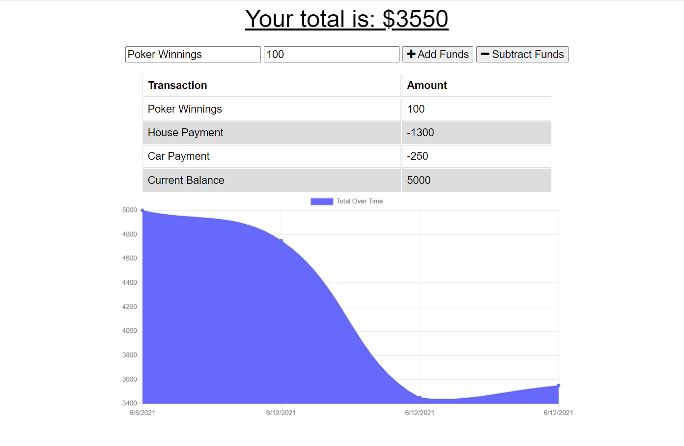

# Budget-Tracker

## Description
This app is a budget tracker that allows the user to Add and Subract from their budget. This app can also be used offline to still enter transactions and it will update with the new data once back online.

## Link to Page
https://enigmatic-peak-06373.herokuapp.com/

## Preview of Application:

## Table of Contents
* [Intallation](#installation)
* [Usage](#usage)
* [License](#license)
* [Contributing](#contributing)
* [Questions](#questions)

## Installation
To install necessary dependencies, run the following command:
~~~
npm i
~~~

## Usage
To run this application the user simply enters the transaction name and amount and then click either to add or subtract this amount. The users balance and chart/graph will then be updated to reflex the changes.

## License 
This project is licensed under the [The Unlicense](http://unlicense.org/) license.

## Contributing
When contributing to this repository, Fork the repo on GitHub, Clone the project to your machine, Commit changes to your own branch, Push your work back up to your fork, then Submit a pull request so your changes can be reviewed.

## Questions
If you have any questions about the repo, open an issue or contact me directly at brandon.l.maxwell@gmail.com. You can find more of my work at [brandon-maxwell](https://github.com/brandon-maxwell).